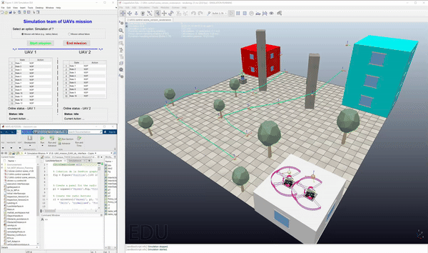

# Self-adaptation based rewards tuning for mission planning in Multi-UAV Systems

This project focuses on demonstrating the effectiveness of the rewards adaptation methodology for constraints management in multi-robot systems. Simulations are conducted on the CoppeliaSim robot simulation platform and MATLAB.

## Table of Contents

- [Overview](#overview)
- [Installation](#installation)
- [Results](#results)
- [Contributing](#contributing)
- [License](#license)

## Overview

This project addresses the use of rewards adaptation methodology for managing constraints in multi-robot systems, particularly UAV missions involving building inspections. The simulations are performed in CoppeliaSim and MATLAB, where the UAVs navigate complex environments with potential obstacles and failures. The goal is to develop autonomous strategies to overcome these constraints using an adaptive control system.

CoppeliaSim provides a versatile simulation environment with a distributed control architecture. It allows control through embedded scripts, plugins, or remote API clients, providing flexibility in the development process. MATLAB is used for modeling and evaluating the missions.

## Installation

### System Requirements

- MATLAB
- CoppeliaSim

### Getting Started

1. Clone the project repository:
    ```bash
    git clone https://github.com/MohandHAMADOUCHE/Self-adaptation-Multi-UAV-System.git
    cd Self-adaptation-Multi-UAV-System
    ```

2. Download and install CoppeliaSim from their [official website](https://www.coppeliarobotics.com/).

3. Open the file `Scene_Coppeliasim_control_2_UAVs.ttt` in CoppeliaSim and click **Start Simulation**.

4. Launch the execution of the MATLAB file `LunchInterface.m` to initialize the control interface:
    ```matlab
    LunchInterface
    ```

5. In the control interface, choose the radio button for **Yes** or **No** depending on the simulation scenario:
   - **Simulation Case 1**: Select **No** for "UAVs without failure".
   - **Simulation Case 2**: Select **Yes** for "UAV with failure".

6. Then follow the mission to observe how the system adapts to the battery failure event.

## Results

### CoppeliaSim Scene and MATLAB Control Interface

In this project, we designed a scene in CoppeliaSim for a building inspection mission, where two UAVs with distinct navigation methods operate in a dynamic environment filled with obstacles. Each UAV has different constraints and uses different policies to complete the inspection.

To control the simulation, a custom GUI in MATLAB is used, allowing the user to select simulation types (with or without battery failure) and monitor UAV policies in real-time. The interface dynamically updates with the mission's progress, offering control over starting and stopping the simulation.

#### Case 1: UAVs without failure

The UAVs follow their predefined paths while avoiding obstacles such as trees and poles. They navigate through the mission and return to base, demonstrating the effectiveness of the adaptive control methodology.

<p align="center">
  
</p>

*Figure 2: GIF showing UAVs successfully navigating the mission without failures.*

#### Case 2: UAV with failure (Battery Exhaustion)

In this scenario, one of the UAVs experiences a battery failure mid-mission. The system detects the failure and adapts by rerouting the neighboring UAV to complete the mission.

<p align="center">
  
</p>

*Figure 3: GIF illustrating the UAV handling a battery failure and adapting to complete the mission.*

## Contributing

We welcome contributions! Please follow the guidelines below:

1. Fork the repository.
2. Create a new branch for your feature or bug fix.
3. Submit a pull request with a detailed explanation of your changes.

## License

This project is licensed under the MIT License - see the [LICENSE](./LICENSE) file for details.

The project is open source and free to use. Please cite this work in your publications:

```bibtex
@misc{Self-adapt,
  author       = {Hamadouche, Mohand},
  title        = {Self-adaptation based rewards tuning for mission planning in Multi-UAV Systems},
  year         = {2024},
  url          = {https://github.com/MohandHAMADOUCHE/Self-adaptation-Multi-UAV-System},
  note         = {GitHub repository, accessed September 18, 2024},
}
